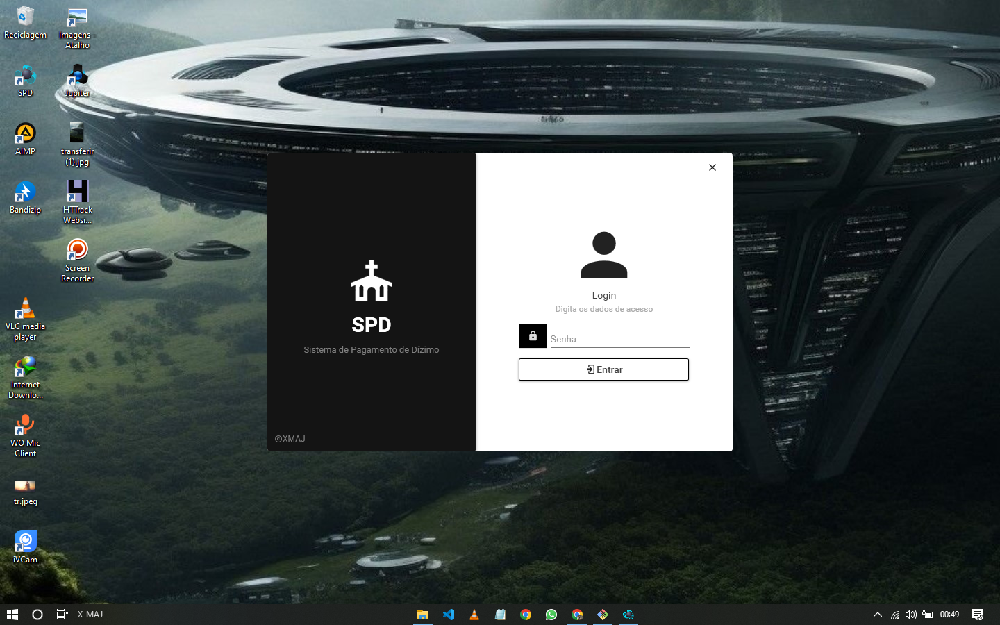
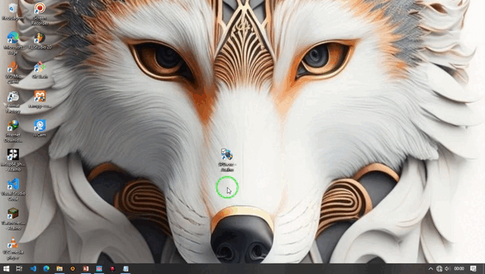
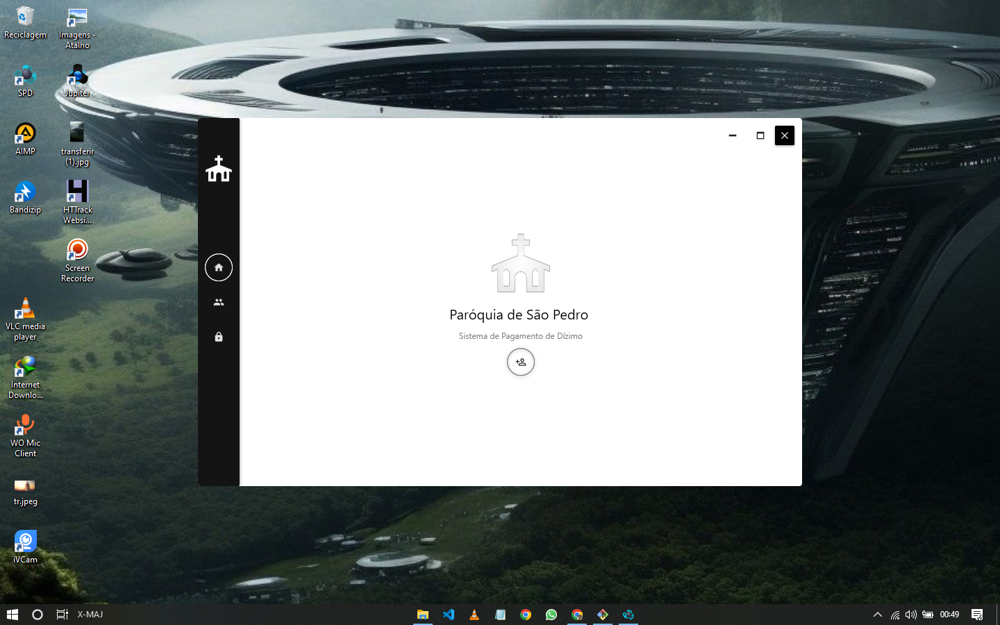
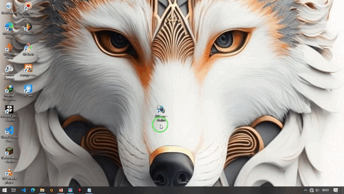
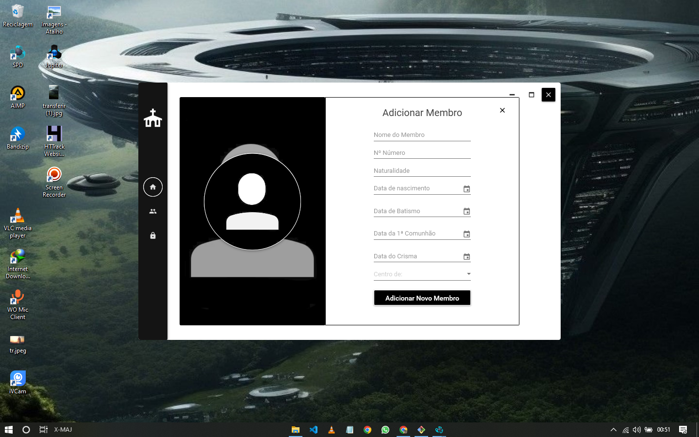
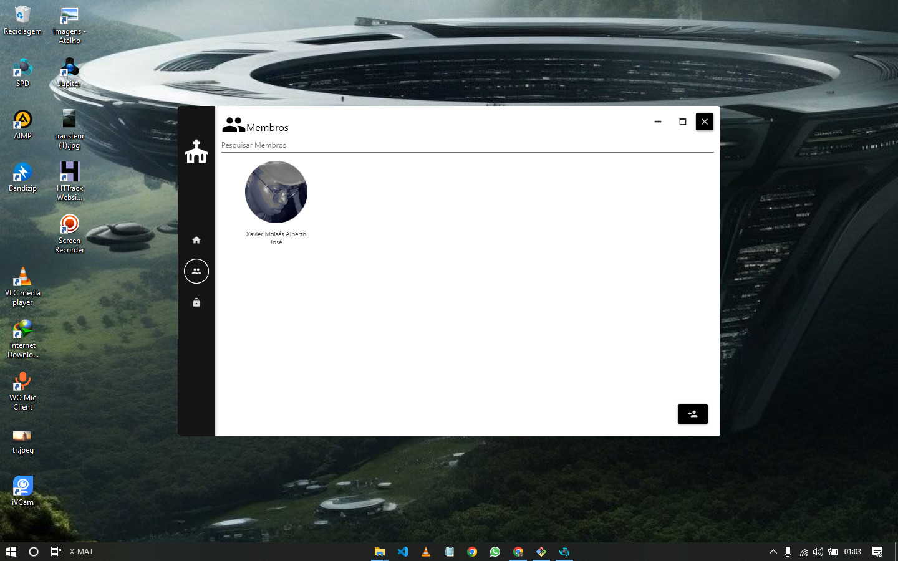
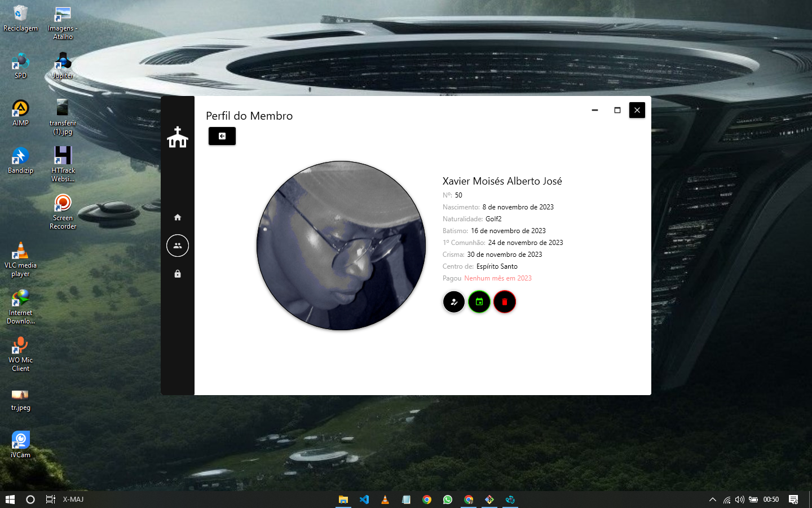
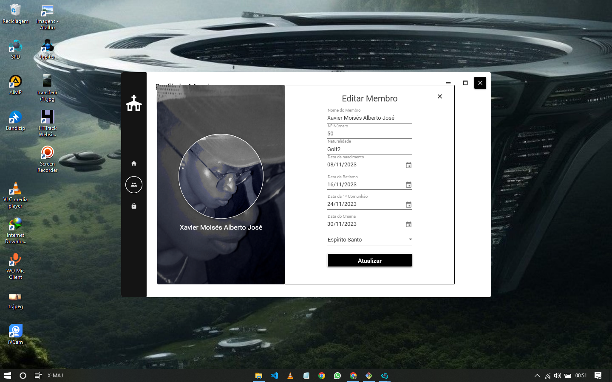
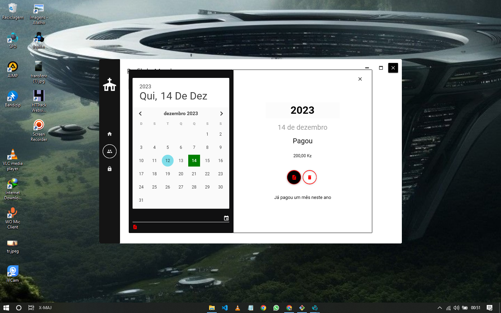

# SPD - Sistema de Pagamento de Dízimo

## Visão Geral

O SPD (Sistema de Pagamento de Dízimo) é um aplicativo desktop completo e funcional desenvolvido em C# para gerenciar membros e pagamentos de dízimos em uma comunidade religiosa. O projeto é privado no GitHub e já foi adquirido por um cliente, sendo utilizado ativamente. Este sistema oferece recursos para adicionar novos membros, editar informações, registrar pagamentos mensais e gerar relatórios.

## Capturas de Tela

### 1. Login

### Demo

- **Descrição:** Acesso ao sistema através de uma chave de acesso e senha padrão ("SPD2023"). Recuperação de senha também está disponível.

### 2. Página Principal

### Demo

- **Descrição:** A página principal exibe botões para adicionar novo membro, listar membros existentes e acessar configurações. Uma barra lateral à esquerda fornece navegação rápida.

### 3. Adicionar Membro

- **Descrição:** Ao clicar em "Adicionar" na página principal, abre-se uma janela para inserir informações de um novo membro, facilitando o registro de novos participantes.

### 4. Lista de Membros

- **Descrição:** A lista de membros apresenta opções de pesquisa por nome ou identificador (ID), além de permitir a adição de novos membros de forma direta.

### 5. Perfil do Membro

- **Descrição:** Ao selecionar um membro da lista, uma página detalhada é exibida, mostrando informações do membro, seus pagamentos de dízimo registrados e permitindo a edição das informações.

### 6. Edição de Informações do Membro

- **Descrição:** Ao clicar no botão de edição, uma janela se abre, possibilitando a alteração das informações do membro.

### 7. Registro de Pagamento

- **Descrição:** Ao clicar no ícone de calendário, abre-se uma janela para registrar os pagamentos de dízimo do membro, permitindo uma visão rápida dos meses pagos.
## Demo

## Instruções de Uso

1. **Clone o Repositório:**
   - Clone o repositório para sua máquina local.

2. **Dependências:**
   - Certifique-se de ter o ambiente C# configurado.

3. **Executando o Sistema:**
   - Abra a solução do projeto em um ambiente de desenvolvimento C# (ex.: Visual Studio).

4. **Acesso Inicial:**
   - Utilize a chave de acesso e a senha padrão (`SPD2023`) para realizar o login inicial.

Este sistema oferece uma solução completa para gerenciar membros e pagamentos de dízimos de forma eficiente e organizada. Para mais detalhes e configurações, consulte a documentação no diretório do projeto.
